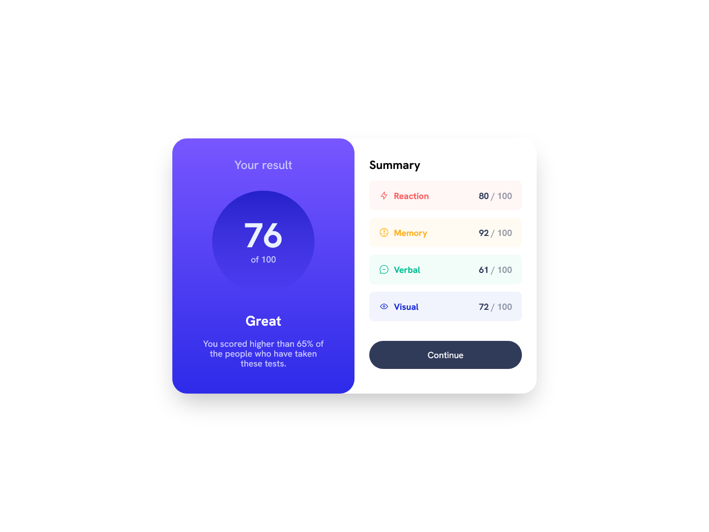

# Frontend Mentor - Results summary component

This is a solution to the [Results summary component challenge on Frontend Mentor](https://www.frontendmentor.io/challenges/results-summary-component-CE_K6s0maV). Frontend Mentor challenges help you improve your coding skills by building realistic projects.

## Table of contents

- [Overview](#overview)
  - [Screenshot](#screenshot)
  - [Links](#links)
- [My process](#my-process)
  - [Built with](#built-with)
  - [What I learned](#what-i-learned)
- [Author](#author)

## Overview

### Screenshot

### Links

- Live Site URL: [Frontend Mentor Results summary component](https://frontend-mentor-results-summary-component-three.vercel.app/)

## My process

I just divided my components into smaller pieces. It was quite a short challenge.

### Built with

- React
- TypeScript
- Tailwind
- Flexbox

### What I learned

I completed this challenge within 7,5 hours. It was my first time with React, TypeScript and Tailwind, bundled by Vite. Deployed on Vercel. I created custom use-counter hook to use counting effect inside my components. I also used useState and useEffect hooks. I'm not really sure if I used TypeScript here properly.

I had problems with json file and icons path. I placed them in my public folder. I have read that it's not a good approach. Please tell me how I can code it better.

Btw. I don't like Tailwind, I don't like inline styling at all. Sass FTW :)

## Author

- Frontend Mentor - [@Pawel-Gnat](https://www.frontendmentor.io/profile/Pawel-Gnat)
